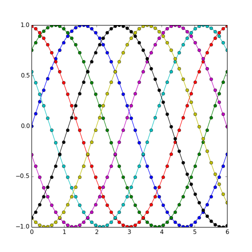

# knitron: knitr + IPython + matplotlib

[](https://travis-ci.org/fhirschmann/knitron)


Knitron brings the power of IPython and matplotlib to [knitr](http://yihui.name/knitr/).

It also brings workspace-like interaction for Python to knitr, so you can define
a variable in one chunk


```python
x = 5
```

and access it in a following chunk


```python
x + 1
```

```
## 6
```

## Requirements

- R and knitr
- A recent version of IPython (knitron relies on the new `IPython.parallel` API)
- pyzmq

## Installation

```r
library(devtools)
install_github("knitron", "fhirschmann")
```

## Design

In order to provide a persistent state for multiple chunks in a document,
knitron makes use of IPython's [architecture for parallel computing](http://ipython.org/ipython-doc/2/parallel/parallel_intro.html). An IPython cluster is started into the background before the chunks are being processed.

## Usage

```r
library(knitron)
```

That's it! Now you can use IPython in knitr using the `engine = 'ipython'` option
(see the [source code](https://raw.githubusercontent.com/fhirschmann/knitron/master/README.Rmd)
of this page for an example).

By default, the `knitr` IPython profile will be used. You can change this using the `knitron.profile` chunk option. If the profile doesn't exist already, it will be created and can then be modified (take a look at `~/.ipython/profile_knitr`). When the first chunk for each profile gets evaluated, a cluster with one engine will be spawned by knitron if it isn't already running. You can also spawn your cluster in a parallel process using

    ipcluster start --profile=knitr --n=1

If the cluster has been spawned by knitron, it will be terminated on exit.

### Chunk Options

The following knitron-specific chunk options are available in knitron:

- `knitron.profile = "knitr"` specifies the IPython profile to be used for the evaluation
  of the chunk.
- `knitron.matplotlib = TRUE` loads matplotlib and pyplot (as `plt`) before executing a chunk.
- `knitron.print = "auto"` will print the string representation of the last object in a code
  chunk. By default, it will not print the string representation of a plot. Other values
  for this option are `TRUE` and `FALSE`.

### Supported Features and Limitations

Most of the original knitr chunk options are supported, including

- `fig.path`
- `fig.width` and `fig.height`
- `dpi`
- `dev` 'pdf' for LaTeX and 'png' for HTML/markdown;
  most of the other devices (e.g. svg, Cairo_png) are supported too

However, there are limitations to some options:

- fig.show only supports 'hold', i.e. all figures are placed at the end of the code chunk
- `dev` currently supports only one device per chunk, i.e. you cannot give a character vector
  so that two plots with different devices are generated

IPython's magic functions are supported too, of course. But there are
some limitations, i.e. magic functions that insert text into the IPython
shell like `%load` without executing them don't work. Likewise, magics
that are meant for interaction use like `%man` and `%edit` cannot work in
knitr.

## Examples

### IPython


```python
from time import sleep

%time sleep(0.5)
```

```
## CPU times: user 0 ns, sys: 0 ns, total: 0 ns
## Wall time: 501 ms
```


```python
%whos
```

```
## Variable     Type                          Data/Info
## ----------------------------------------------------
## matplotlib   module                        <module 'matplotlib' from<...>matplotlib/__init__.pyc'>
## plt          module                        <module 'matplotlib.pyplo<...>7/matplotlib/pyplot.pyc'>
## sleep        builtin_function_or_method    <built-in function sleep>
## x            int                           5
```

### Matplotlib


```python
import numpy as np
x = np.linspace(0, 2 * np.pi, 100)
y1 = np.sin(x)
y2 = np.sin(3 * x)
plt.fill(x, y1, 'b', x, y2, 'r', alpha=0.3)
```


 


```python
L = 6
x = np.linspace(0, L)
ncolors = len(plt.rcParams['axes.color_cycle'])
shift = np.linspace(0, L, ncolors, endpoint=False)
for s in shift:
    plt.plot(x, np.sin(x + s), 'o-')
```


 

### Sympy


```python
import sympy as sm

x, y, z = sm.symbols("x y z")
sm.solve([x * y - 7, x + y - 6], [x, y])
```

```
## [(-sqrt(2) + 3, sqrt(2) + 3), (sqrt(2) + 3, -sqrt(2) + 3)]
```

Of course, you could also use `sm.latex` and `results = 'asis'` in
TeX documents.
